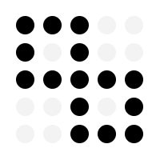

<p align="center">
  <picture>
    <source media="(prefers-color-scheme: dark)" srcset="../assets/logo-dark.png">
    <source media="(prefers-color-scheme: light)" srcset="../assets/logo-light.png">
    
  </picture>
</p>

<h1 align="center">ShellUI Native</h1>

<p align="center">
  One design system, every platform.<br/>
  Copy-and-own native components for .NET MAUI, inspired by <a href="https://ui.shadcn.com/">shadcn/ui</a>.
</p>

<p align="center">
  <a href="https://www.nuget.org/packages/ShellUI.Native.CLI"></a>
  <a href="../LICENSE"></a>
</p>

ShellUI Native is the native cross-platform extension of [ShellUI](https://shellui.dev/), bringing the same design system and component philosophy to MAUI, Avalonia, and other native platforms. Inspired by [shadcn/ui](https://ui.shadcn.com/)'s approach, ShellUI Native provides copy-and-own components for native desktop and mobile development.

## Features

- **Copy & Own** - Components are copied to your project, giving you full control
- **Platform Native** - Pure native controls, no web views, no CSS overhead
- **Lightweight & Fast** - No Tailwind/CSS processing, native styling baked in
- **Consistent Design** - Same design tokens as [ShellUI Blazor](https://shellui.dev/)
- **CLI-First** - Simple command-line interface for adding components
- **Composable** - Build complex UIs from simple components

## No Tailwind Required!

Unlike [ShellUI Blazor](https://shellui.dev/), **ShellUI Native does not use Tailwind CSS**. Native platforms (MAUI/Avalonia/WinUI) use XAML styles and ResourceDictionaries, not CSS. The design tokens (colors, spacing, radii) are identical to ShellUI's Tailwind theme but implemented as native styles - making your app **lightweight and fast** with zero CSS processing overhead.

## Quick Start

```bash
# Install the CLI tool (prerelease)
dotnet tool install -g ShellUI.Native.CLI --prerelease

# Initialize in your MAUI project
shellui-native init --yes

# Add components
shellui-native add button input card

# List all available components
shellui-native list
```

## Supported Platforms

| Platform | Status | .NET Version |
|----------|--------|--------------|
| .NET MAUI | Available (`0.1.0-alpha.1`) — Android, iOS, Mac Catalyst, Windows | .NET 10.0 |
| Avalonia UI | Planned (Phase 2) | .NET 10.0 (Avalonia 12) |
| WinUI 3 | Conditional (Phase 3) | .NET 10.0 |

WPF is intentionally not on this list — it's recognized for project detection only, not an
active component target. See [PLAN.md](./PLAN.md) and [DEVELOPMENT_PLAN.md](./DEVELOPMENT_PLAN.md) for the rationale.

## Blazor MAUI Hybrid Projects

For **Blazor Hybrid** apps, you can use both libraries:

```
┌─────────────────────────────────────────┐
│           MAUI Native Shell             │  ← ShellUI Native
│  ┌───────────────────────────────────┐  │
│  │         BlazorWebView             │  │
│  │  ┌─────────────────────────────┐  │  │
│  │  │     Blazor Components       │  │  │  ← ShellUI (Blazor + Tailwind)
│  │  └─────────────────────────────┘  │  │
│  └───────────────────────────────────┘  │
└─────────────────────────────────────────┘
```

- **[ShellUI (Blazor)](https://shellui.dev/)** - For components inside the BlazorWebView (HTML/CSS/Razor)
- **ShellUI Native** - For native MAUI controls outside the WebView

They're separate rendering contexts with no conflict. Install what you need based on your app architecture.

## Documentation

- [Getting Started](./QUICKSTART.md)
- [Component List](./COMPONENTS.md)
- [Release Notes](./RELEASE_NOTES.md)
- [Releasing](./RELEASING.md) — how a version is published
- [Components Roadmap](./COMPONENTS_ROADMAP.md) — prioritized P0–P7 backlog
- [Development Plan](./DEVELOPMENT_PLAN.md) — branch strategy & phase breakdown
- [Architecture](./ARCHITECTURE.md)
- [Plan](./PLAN.md) — high-level strategy

## Example Usage

```xml
<!-- MAUI XAML -->
<ContentPage xmlns:ui="clr-namespace:YourProject.Components.UI">
    <VerticalStackLayout>
        <ui:Button Text="Click me!" Size="Lg" Clicked="OnButtonClicked" />

        <ui:Card>
            <ui:CardHeader Title="Welcome" Description="Tell us who you are." />
            <ui:CardContent>
                <ui:Input Placeholder="Enter your name" />
            </ui:CardContent>
        </ui:Card>
    </VerticalStackLayout>
</ContentPage>
```

## Project Structure

After initialization, your project will have:

```
YourProject/
├── Components/
│   └── UI/
│       ├── Button.cs
│       ├── Input.cs
│       ├── Card.cs
│       ├── Variants/
│       │   └── ButtonVariants.cs
│       └── Shell.cs
├── Resources/
│   └── Styles/
│       └── ShellUITheme.xaml
└── shellui-native.json
```

## The Shell family

| | Project | |
|---|---|---|
|  | [ShellUI](https://github.com/shellui-dev/shellui) | The Blazor component library this one mirrors |
|  | [ShellIcons](https://github.com/shellui-dev/shell-icons) | Lucide icons for Blazor, MAUI and Avalonia; the source of the `icon` component |
|  | [ShellDocs](https://github.com/shellui-dev/shelldocs) | The docs framework behind the ShellUI sites |

Inspired by [shadcn/ui](https://ui.shadcn.com/).

## License

MIT License - see [LICENSE](../LICENSE) for details.
